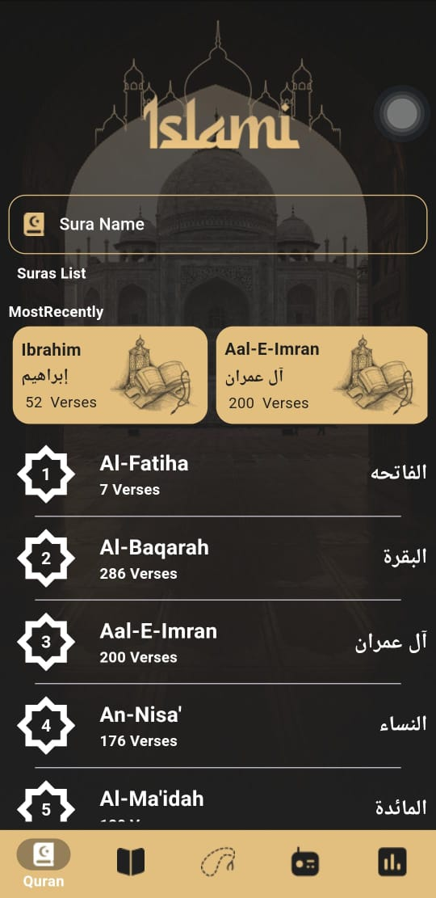
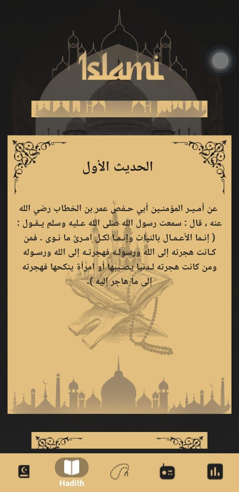
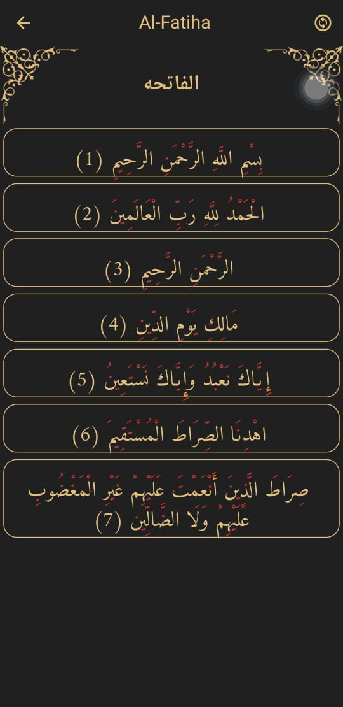

# 🕌 Islami App

A Flutter application that helps users read Quranic Surahs, Hadiths, and perform digital Tasbeeh.  
The app provides a clean and user-friendly UI with multiple features to enhance the Islamic experience.

---

## 🚀 Features
- 📖 Browse and read **Quranic Surahs**
- 📜 View selected **Hadiths**
- 📿 Digital **Tasbeeh counter**
- 🌙 Light & Dark mode support
- 🌐 Multi-language support (Arabic / English)
- ⚡ Offline usage with local storage (SharedPreferences)

---

## 📸 Screenshots

  
  
  

  
  
  
  

---

## 🛠️ Technologies
- **Flutter & Dart**
- **SharedPreferences (Local Storage)**
- **Material Design & Responsive UI**

---

## 🔗 Links
- [GitHub Repository](https://github.com/AhmedAtef202/islami_app)
